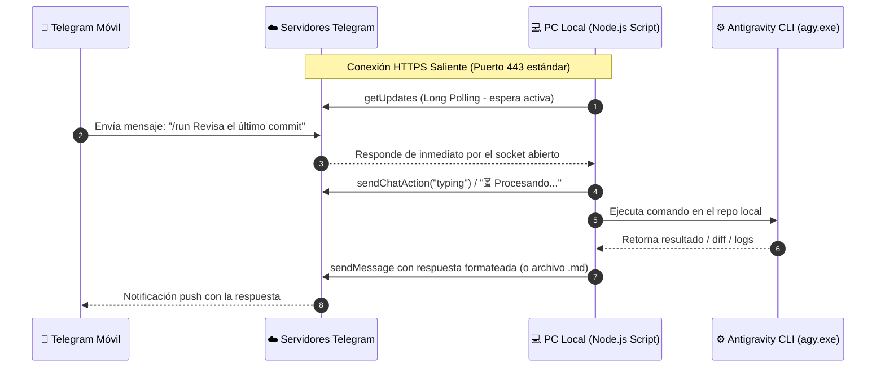

# Plan de Integración: Telegram Bridge para Antigravity & Claude Code

**Fecha de inicio:** 2026-08-29  
**Estado:** Borrador v2 — Decisiones cerradas  
**Objetivo principal:** Controlar y consultar tareas de desarrollo asistido por IA (Antigravity CLI / Claude Code) desde el móvil vía Telegram a coste $0, funcionando de manera transparente y sin fricciones en entornos con **CGNAT**.

---

## 0. Decisiones Cerradas (revisión 2026-08-29)

| Decisión | Elección | Alternativa descartada | Motivo |
| :--- | :--- | :--- | :--- |
| Librería Telegram | **grammY** | Telegraf | Mantenimiento activo, API moderna, error handling claro. Telegraf está estancado. |
| Executor | **Autocontenido** en `telegram-bridge/` | Extraer lib compartida del MCP server | El MCP server es estable y sin dependencias; un spawn propio de `agy` son ~100 líneas. Se extraerá lib compartida solo si aparece un tercer consumidor. |
| Aprobaciones | **Entre-turnos**: `/plan` → botón `[✅ Ejecutar]` → `agy_run` modo `accept-edits` con `conversation_id` | Pausa externa mid-run | `agy` corre headless con `dangerously_skip_permissions`; no existe hook de aprobación externa. La aprobación entre turnos es factible con los flags actuales. |
| Runtime producción | **Windows Node** + Task Scheduler | WSL Node + systemd | Acceso nativo a `agy.exe`, `LOCALAPPDATA` y perfil de usuario. NSSM como SYSTEM rompería las rutas de perfil que usa agy. |

---

## 1. Motivación y Principios de Diseño

1. **Coste $0.00**:
   - Evitar suscripciones de pago de aplicaciones móviles (ej. Claude Pro / Team a $20/mes).
   - Uso de la API de Bots de Telegram (100% gratuita, sin cuotas por mensaje).
   - Aprovechamiento de cuotas gratuitas de modelos mediante `agy.exe` (Gemini Flash / Pro).
2. **Cero configuración de red / Sin túneles de pago**:
   - Operación completa bajo **CGNAT** (Carrier-Grade NAT) y redes domésticas con IP dinámica o privada.
   - Sin apertura de puertos en el router (no port forwarding).
   - Sin necesidad de servicios de túneles externos ni certificados SSL propios.
3. **Seguridad Absoluta (Zero-Trust para terceros)**:
   - Whitelist estricta basada en el `telegram_user_id` del propietario.
   - Cualquier interacción de usuarios no autorizados es descartada silenciosamente en el primer ciclo del middleware.
   - Integración con las políticas de permisos granulares de Antigravity (`deny_commands`, `deny_paths`).

---

## 2. Viabilidad en Entorno CGNAT (Long Polling vs Webhooks)

### El problema de CGNAT
En CGNAT, el proveedor de internet (ISP) comparte una única IP pública entre múltiples clientes. Esto impide que internet pueda iniciar conexiones entrantes a tu máquina (los webhooks tradicionales de Telegram fallan sin túneles como Ngrok o Cloudflare).

### La solución: Long Polling saliente
El protocolo de Telegram soporta **Long Polling** nativo (`getUpdates`):



### Ventajas de este enfoque para CGNAT:
- **Tráfico 100% saliente (Outbound HTTPS)**: Para el router y el ISP, la conexión es idéntica a navegar por una web en el navegador.
- **Resiliencia ante microcortes e IP dinámica**: Si el ISP renueva la IP o hay una desconexión momentánea de red, el bot reconecta automáticamente sin perder mensajes (Telegram retiene los mensajes en cola en sus servidores).
- **Latencia mínima (<100–200ms)**: A pesar de llamarse "polling", es un *hanging HTTP request*, por lo que la notificación llega de forma instantánea.

---

## 3. Arquitectura del Componente Bridge

El bridge residirá como un servicio/script ligero en Node.js (Windows) dentro de la máquina local. Executor **autocontenido**: no refactoriza `mcp-server/index.js`, pero **hereda su política de seguridad por defecto** (`deny_commands: ['git push*', 'npm publish*', 'git reset --hard*', 'rm -rf /*']`, `deny_paths: ['.env*', '**/*.key', '**/*.pem']`).

```
claude-plugin-antigravity/
├── telegram-bridge/                 # Módulo puente (propuesto)
│   ├── .env                         # TELEGRAM_BOT_TOKEN, ALLOWED_USER_IDS, WORKSPACE_DIR (ya cubierto por .gitignore raíz)
│   ├── .env.example
│   ├── bot.js                       # Loop de polling grammY, middleware whitelist, lock single-instance, cola de tareas
│   ├── executor.js                  # Spawn de agy.exe con execFile (sin shell), política deny_commands por defecto
│   ├── formatter.js                 # Chunking de mensajes (límite 4096) por párrafos/fences + conversión a HTML
│   ├── state.json                   # Persistencia: chat → último conversation_id, cola de tareas pendientes (gitignored)
│   └── package.json                 # grammY como única dependencia
```

**Notas de arquitectura y decisiones operativas:**
- **`executor.js` autocontenido**: Duplica deliberadamente la resolución de binario de `mcp-server/index.js` (`resolveAgyBin`: PATH → `%LOCALAPPDATA%\agy\bin\agy.exe`) y hereda la política de seguridad por defecto (`deny_commands: ["git push*", "git reset --hard*", "npm publish*", "rm -rf /*"]`, `deny_paths: [".env*", "**/*.key", "**/*.pem"]`). Deuda técnica aceptada conscientemente para no tocar el servidor MCP hasta que exista un tercer consumidor.
- **`ALLOWED_USER_IDS`**: Configurado en `.env` como lista de IDs separados por comas (formato plural) para admitir múltiples IDs autorizados sin reescribir el parser en el futuro.
- **Lock single-instance (PID lockfile)**: Dos instancias concurrentes ejecutando `getUpdates` provocan `409 Conflict` en la API de Telegram. El bot adquiere un lockfile con el PID al arrancar y aborta de inmediato si ya hay una instancia activa.
- **Cola de ejecución = 1**: Mientras una tarea `agy` esté corriendo, los comandos entrantes reciben respuesta `"⏳ Tarea en curso"` y se encolan en `state.json` (no se descartan ni se ejecutan en paralelo).
- **Persistencia en `state.json`**: Guarda el `conversation_id` por chat para garantizar que el soporte multiturno (`--resume`) sobreviva a reinicios del daemon o del sistema.
- **Resiliencia de red**: Manejo automático de backoff ante reconexiones y respeto estricto del parámetro `retry_after` ante respuestas HTTP 429.

---

## 4. Retos Técnicos y Soluciones Identificadas

| Reto Técnico | Impacto | Estrategia de Solución |
| :--- | :--- | :--- |
| **Límite de 4096 chars de Telegram** | Respuestas de código o revisiones largas son rechazadas por la API si exceden el límite. | - Si la respuesta es ≤ 4000 caracteres: se envía como mensaje de texto Markdown.<br>- Si la respuesta excede 4000: se divide inteligentemente por párrafos o se envía como archivo adjunto `.md` / `.txt`. |
| **Seguridad y Acceso No Autorizado** | El bot es público en la red de Telegram si alguien conoce su @username. | **Whitelist dura**: Middleware obligatorio `if (ctx.from.id !== ALLOWED_USER_ID) return;`. Ni siquiera se responde a desconocidos para evitar reconocimiento. |
| **Feedback y Latencia de LLM** | Tareas complejas con agentes pueden tardar entre 15s y 2 minutos. | - Disparar `ctx.replyWithChatAction('typing')` en intervalos.<br>- Enviar un mensaje inicial con estado `⏳ En proceso...` y editarlo conforme haya updates (`editMessageText`). |
| **Inyección de comandos de terminal** | Riesgo si se ejecutan comandos directos sin sanitizar. | - No ejecutar mediante shell libre `cmd /c`. Usar llamadas estructuradas con `execFile` o sanitización de argumentos.<br>- Forzar `deny_commands` y `deny_paths`. |
| **Confirmaciones interactivas (Aprobaciones)** | Acciones peligrosas (editar archivos críticos, git push) requieren confirmación humana. | Uso de **Inline Keyboards** de Telegram: botones interactivos `[ ✅ Aprobar ]` y `[ ❌ Cancelar ]` directamente en el chat móvil. |

---

## 5. Hoja de Ruta de Implementación (Roadmap de Iteración)

- [x] **Fase 1: Preparación de Credenciales**
  - Registro del bot con `@BotFather` (obtención de token).
  - Identificación del `ALLOWED_USER_IDS` vía `@userinfobot`.
  - Crear `telegram-bridge/.env` a partir de `telegram-bridge/.env.example`.

- [x] **Fase 2: Prototipo Mínimo Viable (PoC) & Core**
  - Script Node.js con `grammY` y Long Polling saliente (100% compatible con CGNAT).
  - Middleware de Whitelist estricta (`ALLOWED_USER_IDS`) con descarte silencioso de accesos no autorizados.
  - Lockfile de instancia única (`bridge.lock`) con detección de PID huérfano para evitar `409 Conflict`.
  - Cola de ejecución serializada (`concurrency = 1`) y persistencia en `state.json`.

- [x] **Fase 3: Integración con Antigravity (`agy.exe`)**
  - Conector autocontenido `executor.js` con resolución nativa de `agy.exe` en Windows/PATH.
  - Heredada política de seguridad por defecto (`deny_commands`, `deny_paths`).
  - Módulo `formatter.js` con división inteligente de mensajes (`splitMessage` a 3800 chars) y preservación de bloques de código Markdown.
  - Soporte multiturno persistente vinculando chats con `conversation_id`.

- [x] **Fase 4: Comandos Rápidos y Experiencia Móvil**
  - `/plan <tarea>`: Planificación en modo de solo lectura (`mode: 'plan'`).
  - Botón interactivo inline `[✅ Ejecutar cambios]` para disparar ejecución real entre turnos.
  - `/run <tarea>`: Ejecución directa con modificación de archivos.
  - `/resume <tarea>`: Continuación de la sesión actual.
  - `/status` y `/reset`: Consulta de estado y reinicio de sesión.
  - Suite de validación automatizada: `npm test` en `telegram-bridge/`.

- [ ] **Fase 5: Servicio en Segundo Plano (Daemon en Windows)**
  - Configuración opcional con el Programador de Tareas de Windows (Task Scheduler) para arranque automático al iniciar sesión.

---

## 6. Arquitectura Agéntica Entorno ➔ Teléfono (Completada)

El sistema soporta flujo bidireccional completo: no solo recibir instrucciones desde el teléfono, sino permitir que **Claude Code** y **Antigravity** notifiquen, alerten, consulten decisiones y envíen audios al móvil de forma totalmente autónoma.

### 🎙️ Integración de Audio con Voicebox
- **Ruta de capturas del usuario:** `%APPDATA%\sh.voicebox.app\captures` (o `C:\Users\<UserAccount>\AppData\Roaming\sh.voicebox.app\captures`)
- **Ruta de generaciones TTS:** `%APPDATA%\sh.voicebox.app\generations` (o `C:\Users\<UserAccount>\AppData\Roaming\sh.voicebox.app\generations`)
- **Entrega como Nota de Voz nativa:** `sendTelegramVoice` envía los audios generados utilizando el método `sendVoice` de Telegram (con fallback inteligente a `sendAudio` si es `.wav`), reproduciéndose como nota de voz con onda sonora integrada en el teléfono.

### 🛠️ Herramientas MCP Expuestas para Claude Code & Antigravity

1. **`telegram_notify`**:
   - Envía alertas instantáneas (`info`, `success`, `warning`, `error`) con formato markdown y soporte para adjuntar archivos/capturas de pantalla.
2. **`telegram_ask` (Human-in-the-Loop)**:
   - Pausa la ejecución del agente y envía una pregunta con botones inline interactivos al móvil (`[Aprobar] [Rechazar]`).
   - El agente espera hasta que el usuario pulse una opción en su teléfono y reanuda su tarea con la respuesta elegida.
3. **`telegram_send_voice`**:
   - Localiza automáticamente el audio más reciente en las carpetas de Voicebox (`captures/`, `generations/` o `profiles/`) y lo despacha al móvil como nota de voz.
4. **`agy_narrate` (Integración nativa)**:
   - Parámetro `send_telegram: true` (habilitado por defecto): cuando Voicebox sintetiza la narración de un checkpoint, el plugin la envía inmediatamente como nota de voz a Telegram.

