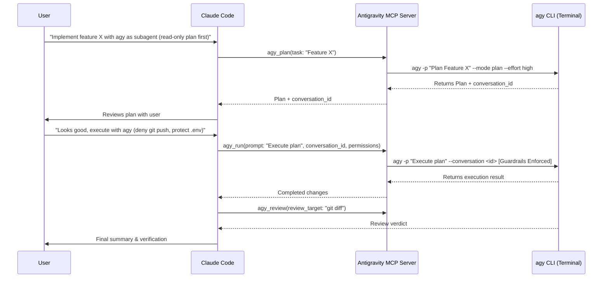

# Antigravity Subagent Skill

This skill teaches Claude Code how to collaborate with **Google Antigravity CLI (`agy`)** as a complementary autonomous subagent and pair-programming partner.

## Overview

Antigravity (`agy`) is Google's terminal-based AI development agent powered by Gemini models (Gemini 2.5 / 3.7 Pro and Flash) with extended reasoning capabilities. It has native terminal access, code editing capabilities, background task management, and workspace discovery.

By pairing Claude Code and Antigravity:
- **Claude Code** acts as the primary orchestrator, interactive driver, or pair programmer.
- **Antigravity (`agy`)** acts as an autonomous subagent for deep reasoning, architectural planning, second opinions, and independent verification.

## When to Delegate to Antigravity

Delegate tasks to Antigravity when:
1. **Architectural Planning**: The task is complex and benefits from a high-effort reasoning breakdown (`agy_plan`).
2. **Autonomous Implementation / TDD**: You want a self-contained feature, refactoring, or test suite implemented end-to-end (`agy_run`).
3. **Adversarial Code Review / Sanity Check**: After modifying code, ask Antigravity to review the diff against project guidelines (`agy_review`).
4. **Second Opinion on Tricky Bugs**: When troubleshooting a puzzling bug or flaky test, delegate an investigation to Antigravity with a fresh perspective.
5. **Session Documentation & Anti-Compaction**: When the conversation gets long or at the end of a session, generate a structured markdown summary (`agy_session_summary`).
6. **Deep Web Research**: When comprehensive live information with cited sources is required (`/agy-research`).

## Tool Reference

### 1. `mcp__antigravity__agy_run`
Run an autonomous Antigravity session.

```json
{
  "prompt": "Implement the missing test cases in src/lib/__tests__/date-contract.test.ts. Run 'npm test' to verify and fix any failures.",
  "model": "gemini-3.7-flash",
  "effort": "high",
  "permissions": {
    "allow": ["read", "edit", "commands"],
    "deny": ["network"],
    "deny_paths": [".env*", "**/*.key"],
    "deny_commands": ["git push*", "npm publish*"],
    "sandbox": false
  },
  "dangerously_skip_permissions": true
}
```

**Granular Permissions Policy:**
- `allow`: Capabilities permitted (`read`, `edit`, `commands`, `network`).
- `deny`: Capabilities forbidden (e.g. `deny: ["edit"]` clamps execution to read-only mode).
- `deny_paths`: File/directory patterns that Antigravity is strictly forbidden from accessing or editing.
- `deny_commands`: Command patterns that Antigravity is strictly forbidden from executing.
- `sandbox`: Enables Antigravity's terminal sandbox restrictions (`--sandbox`).

**Multi-Turn Threading:**
`agy_run` returns a `conversation_id`. To continue the same thread in a follow-up step:
```json
{
  "prompt": "Now also update the documentation in docs/architecture.md to reflect the new test cases.",
  "conversation_id": "94e7260d-51bb-478b-96ac-092525396df8"
}
```

### 2. `mcp__antigravity__agy_plan`
Produce a comprehensive implementation plan without making edits (guaranteed read-only).

```json
{
  "task": "Migrate legacy button classes to Radix UI across src/components/finance.",
  "model": "gemini-2.5-pro",
  "effort": "high"
}
```

### 3. `mcp__antigravity__agy_review`
Perform a thorough code review of recent changes (guaranteed read-only).

```json
{
  "review_target": "git diff HEAD~1",
  "guidelines": "Verify compliance with AGENTS.md, WCAG accessibility rules, and TypeScript strict checks."
}
```

### 4. `mcp__antigravity__agy_usage`
Display session token telemetry (input, output, thinking, cache read), context window saturation, active model limits, and quota status. Pass `reset: true` to clear session counters.

### 5. `mcp__antigravity__agy_status`
Check CLI path, version, active model/effort defaults, and active ALLOW/DENY permission policies.

### 6. `mcp__antigravity__agy_set_config`
Persist defaults for model, effort, or ALLOW/DENY policies in `~/.claude/antigravity.json` or `.claude/antigravity.json`.

```json
{
  "model": "gemini-3.7-flash",
  "effort": "high",
  "permissions": {
    "deny_paths": [".env*", "**/*.key", "**/*.pem"],
    "deny_commands": ["git push*", "npm publish*"]
  },
  "scope": "project"
}
```

### 7. `mcp__antigravity__agy_session_summary`
Read Claude Code's session JSONL log, preprocess turns to filter noise, and generate a structured markdown summary using Gemini. Solves context compaction degradation.

```json
{
  "focus": "full",
  "model": "gemini-3.7-flash",
  "effort": "high"
}
```
Available focuses: `"full"`, `"decisions"`, `"changes"`, `"debugging"`. Summaries are saved to `~/.claude/session-summaries/<date>-<session-id>.md`.


## Collaboration Workflow


