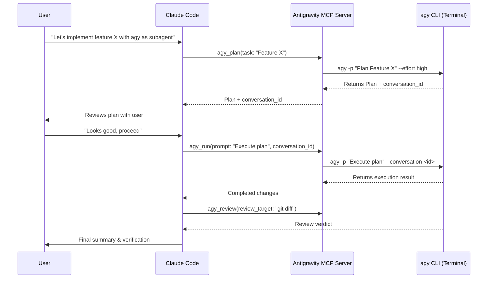

# Antigravity Subagent Skill

This skill teaches Claude Code how to collaborate with **Google Antigravity CLI (`agy`)** as a complementary autonomous subagent and pair-programming partner.

## Overview

Antigravity (`agy`) is Google's terminal-based AI development agent powered by Gemini models (Gemini 2.5 / 3.7 Pro and Flash) with extended reasoning capabilities. It has native terminal access, code editing capabilities, background task management, and workspace discovery.

By pairing Claude Code and Antigravity:
- **Claude Code** acts as the primary orchestrator, interactive driver, or pair programmer.
- **Antigravity (`agy`)** acts as an autonomous subagent for deep reasoning, architectural planning, second opinions, and independent verification.

## When to Delegate to Antigravity

Delegate tasks to Antigravity when:
1. **Architectural Planning**: The task is complex and benefits from a high-effort reasoning breakdown (`agy_plan`).
2. **Autonomous Implementation / TDD**: You want a self-contained feature, refactoring, or test suite implemented end-to-end (`agy_run`).
3. **Adversarial Code Review / Sanity Check**: After modifying code, ask Antigravity to review the diff against project guidelines (`agy_review`).
4. **Second Opinion on Tricky Bugs**: When troubleshooting a puzzling bug or flaky test, delegate an investigation to Antigravity with a fresh perspective.

## Tool Reference

### 1. `mcp__antigravity__agy_run`
Run an autonomous Antigravity session.

```json
{
  "prompt": "Implement the missing test cases in src/lib/__tests__/date-contract.test.ts. Run 'npm test' to verify and fix any failures.",
  "effort": "high",
  "dangerously_skip_permissions": true
}
```

**Multi-Turn Threading:**
`agy_run` returns a `conversation_id`. To continue the same thread in a follow-up step:
```json
{
  "prompt": "Now also update the documentation in docs/architecture.md to reflect the new test cases.",
  "conversation_id": "94e7260d-51bb-478b-96ac-092525396df8"
}
```

### 2. `mcp__antigravity__agy_plan`
Produce a comprehensive implementation plan without making edits.

```json
{
  "task": "Migrate the legacy button classes to the new Radix UI button component across src/components/finance.",
  "effort": "high"
}
```

### 3. `mcp__antigravity__agy_review`
Perform a thorough code review of recent changes.

```json
{
  "review_target": "git diff HEAD~1",
  "guidelines": "Verify compliance with AGENTS.md, WCAG accessibility rules, and TypeScript strict checks."
}
```

### 4. `mcp__antigravity__agy_status`
Quick health check to confirm Antigravity CLI path and version.

## Collaboration Workflow


